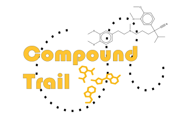

# Compound Trail 

The Compound Trail is a laboratory sample tracking system to document the movements of compound vials, plates, and misc. 
labware between the compound management department and users requesting samples. There are two parts, compounds delivered for in vivo 
formulations and general compound delivery. Permission levels allow users to access only the parts of the system that are relevant to their 
work. The system is deployed on an R Shiny server and accessible through an iPad attached to a barcode scanner in the compound management
satellite delivery room. 

## Databases
Three databases are connected to the Compound Trail: the inventory database that tracks individual vials and usage by compound management, the 
formulations database that tracks all pre-clinical in vivo studies on campus, and the compound management database that tracks each user and
delivery/return/pick-up. 

All samples weighed out for use from the main stock storage are registered with a barcode for each vial/plate and amount dispensed in the inventory system.
When compound samples are delivered to the delivery room, the inventory barcode is scanned into the Compound Trail which retrieves the compound name, 
registration number and amount from the inventory system. 

## User documenting and permissions 
User badge numbers are stored in the compound management database linked to permissions levels allowing them access to only the parts of the 
system that are relevant to their work. These levels are admin, compound management members, general users, and formulations users. 

General delivery users have access only to scan in labware barcodes for pick-up or return. 

Formulations users have access to the formulations page, which pulls up details about in vivo studies currently active using that 
specific compound so that the sample can be directly linked to the project. The available actions are delivered or received. 

Compound management team members have access to both general tracking and formulations tracking, with only delivery or return received options.

Prior to use, the user must be registered and provided a permission level. To access the system, the registered user must scan their employee badge which will 
allow the part of the system they are approved for appear and be used. 

## General Delivery
The general delivery page allows users to scan in the inventory barcode(s) and select whether they are picking up
the sample(s) from the drop-off refrigerator or returning samples to compound management. Compound management team members scan barcode(s) and select if
they are delivery samples for users or if they are picking up returns. This information, along with the time stamp, is 
recorded in the general chemtrack table in the compound management database. 

Additional drop-down options are available for vials that have not been registered in the inventory database yet ("Custon") and for specialized
"Delivery" barcodes which are created in a separate app by compound management to bulk register large sets of compound vials/plates so only a single
barcode has to be scanned upon delivery/pickup. These values will populate the database with all of the barcodes registered under the delivery barcode, 
the same as if multiple samples had been scanned. When the delivery barcode is scanned, the number of expected plates/vials will be shown, to ensure the entire set is present.

## Formulations Delivery
The formulations delivery page allows users or compound management team members to scan in the inventory barcode, which queries the inventory database
for the compound registration number and the amount in the vial being delivered. 
The registration number is then used to query the formulations database and outputs all active projects using that compound, as well as the expected 
amount of compound to be delivered and the lab associated with the project. The correct project is selected by the user, 
based on the information associated with the request and the amount being delivered. This vial and the amount is then recorded in the
formulations database and linked to the project it is to be used for. This allows for downstream tracking of compound usage and alerting users when
more compound needs to be ordered. This step is outside of the scope of this system, however. 

An additional dropdown option is available in the formulations page as well, for samples that have not been registered in the inventory system yet ("Custom"). 
In this case, the user must manually select the lab, enter the amount in the vial, and enter the barcode. 

The formulation vial barcode, user badge information, and timestamp are recorded in both the formulations database and the compound management database. 

